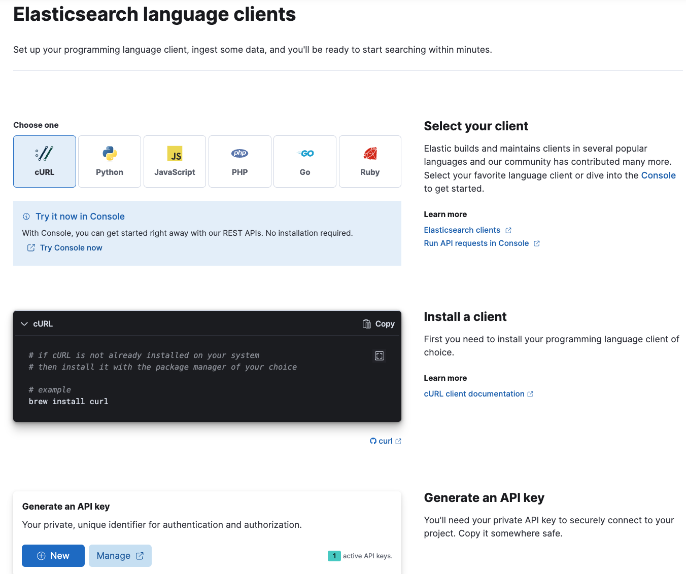
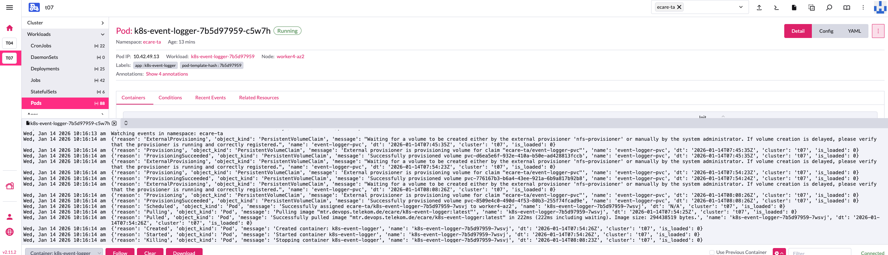
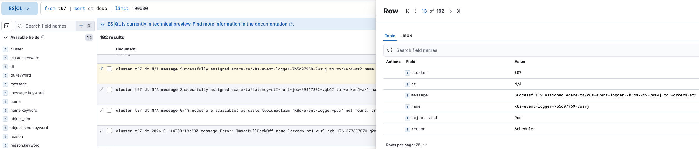

This project was created to quickly log k8s events to Elastic.  
A run-time layer with SQLite logging was added to eliminate potential duplicates:  
 when a pod is restarted, k8s event data is read again and then written to Elastic again.  
To prevent this, the data is first written to SQLite, then, as it is written to Elastic,  
  it is marked as is_loaded=1 and then rotated mountly.   
If the pod with logger will be restarted, the old data/events.db will be loaded from pvc, and events already loaded into Elastic will not be duplicated.  
  
Before the deployment you have to obtain Elastic endpoint and ApiKey, usually it is possibe via https://_your_elastic_ip:443//app/enterprise_search/elasticsearch  
  
After the "helm install" example, shown in .gitlab-ci.yml, you will obtain deployment:  
  
The deployment will contain one pod:  
  
And, finally, the pod will produce the following data in your Elastic endpoint:  

